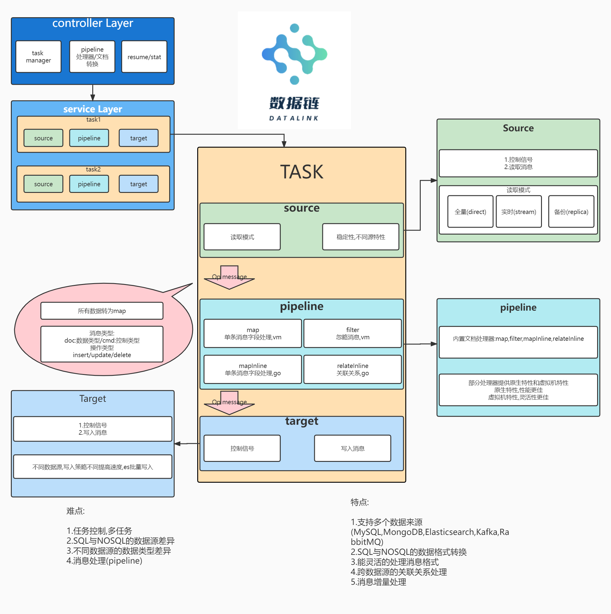

让不同的数据源连通的恰到好处

### TODO

- MySQL多主键增量更新有问题.

### True

- MySQL dump 支持
- MongoDB dump 支持
- 任务管理的 command line 支持
- pipeline的文档转换
- pipeline中跨数据源,关联关系
- MongoDB的读写,Elasticsearch的读写,PlainText的读写
- Task的错误日志
- MySQL的读写
- resume:MySQL,MongoDB已经实现
- 新建任务的简单校验
- **debugUI**加入**basic auth**
- 实现stream的buffer值,关联入库

## 项目结构

### /app

程序入口

```
-app
|---datalink
    |---main.go // 程序入口 
```

### /build

构建脚本,暂未使用

### /datalink

源码

```
-datalink
|---linkd // 提供web接口,控制任务等
|---loop  // 任务执行
|---terms // 对各种资源的读写实现
```

### /docs

文档目录,各任务配置说明以及**http**的**api**说明

### /examples

任务的示例

### /internal

内部定义常量等

### /linkadmin

目前为web控制台,debug使用

### /runtime

任务文件,运行时临时文件

### 程序结构

